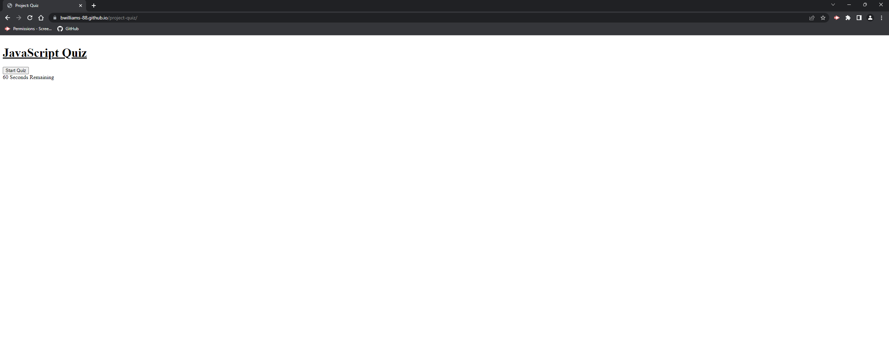

# Project Quiz

## The assignment this week was to create a quiz with some questions, a few buttons (start quiz, next question, and submit), and a timer. I found this assignment to be decently challenging between all the parts it consisted of between the buttons, timer, and questions it really challenged us to use all the tools we have learned in class so far.

## https://bwilliams-88.github.io/project-quiz/
